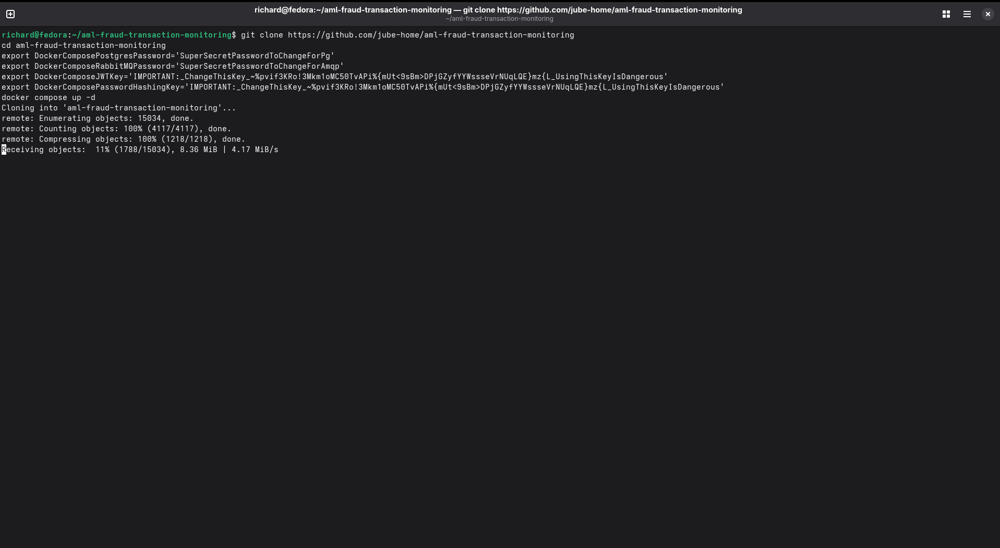
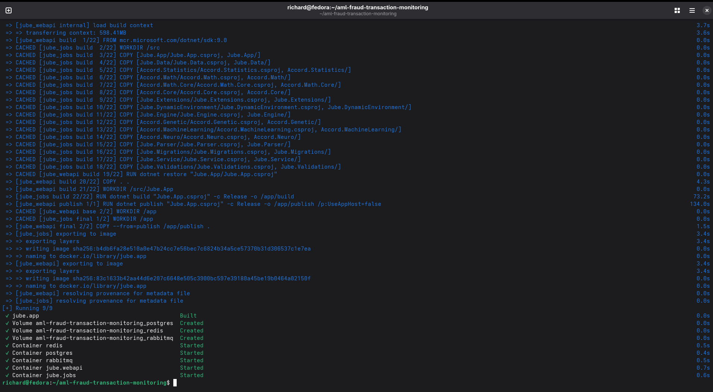
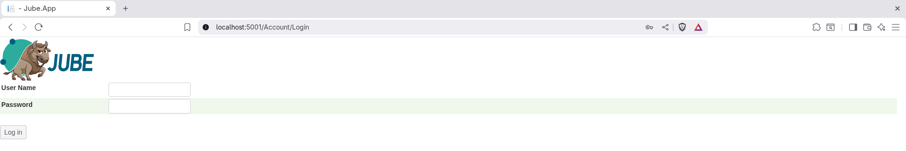
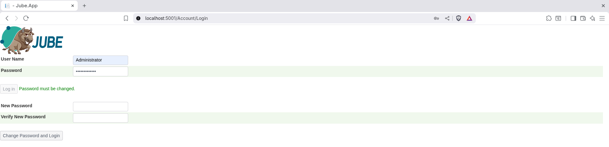
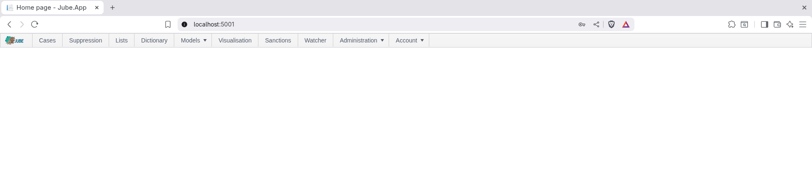

Jube is an **open source AML software** and **open source fraud detection software** platform for real-time detection of
suspicious transactions, AML case management, and fraud prevention.

[Jube is fully open-source (AGPLv3)](https://github.com/jube-home/aml-fraud-transaction-monitoring)
with all features available and no vendor lock-in, Jube is transparent,
auditable, and extensible—keeping your data under your control while enabling rapid adaptation to new products,
workflows, regulations, or payment schemes.

---

Jube combines real-time transaction monitoring, adaptive machine learning, rule-based detection, and workflow-driven
case management into a single, scalable system.

Designed for compliance teams, financial institutions, and fintechs, Jube provides:

- Accurate and interpretable risk scoring using supervised and unsupervised machine learning models
- Rule-based detection with thresholds, velocity checks, aggregation counts, and sanctions screening
- Workflow-driven AML and fraud case management with automated escalation and full audit trails
- Cloud-native deployment with Docker and Kubernetes support, multi-tenancy, configuration preservation, and
  high-performance caching for low-latency decisioning

Jube ensures accuracy, transparency, and auditability, making it ideal for organizations that must meet strict
regulatory requirements while monitoring large transaction volumes.


---

## Key Features

- Trusted **open source AML and fraud detection software** for compliance and fraud prevention
- Real-time transaction monitoring
- Hybrid detection engine: combining rule‑based logic for **open source AML and fraud detection**
- Adaptive machine learning models for AML and fraud risk scoring
- Workflow-driven AML and fraud case management
- Fully **open source AML and fraud detection software** under AGPLv3

### Adaptive Machine Learning — Exhaustive Adaptation

Jube leverages adaptive machine learning for AML and fraud detection, combining anomaly detection, supervised risk
models, and continuous model training to identify both known and emerging threats, while deriving behavioral features
for interpretable and actionable risk insights.

- Unsupervised learning identifies deviations from normal customer behavior for anomaly detection
- Supervised learning models detect known fraud and AML patterns based on historical data
- A hybrid approach combines supervised and unsupervised methods
- “Exhaustive Adaptation” evolves the model topology — trying different neural-network
  structures and variables — to find well‑generalized, computationally efficient models as data patterns change
- Behavioral feature abstraction derives signals such as transaction volume, velocity, and geolocation to improve ML
  model interpretability


### Real-Time Transaction Monitoring

Jube’s real-time transaction monitoring engine detects suspicious activity instantly, enabling financial institutions
and fintechs to respond to fraud and AML risks as they occur. The engine combines low-latency processing, scalable
architecture, and reliable storage to handle large transaction volumes efficiently.

- Stateless, horizontally scalable architecture
- Low-latency, in-memory processing with Redis for real-time state mutable state
- Frequently accessed immutable state stored locally also to minimize network overhead, reduce
  serialization/deserialization, and
  increase server density, ensuring fast, scalable decisioning under high load
- Durable storage and audit logs with PostgreSQL
- AMQP integration (RabbitMQ) for inbound and outbound events
- Full support for synchronous and asynchronous interfaces via HTTP, AMQP, and hybrid modes
- Asynchronous archival of decision payloads for analytics and reporting
- Real-time reprocessing of past data available for integration of fresh intelligence and analysis of exposure

### Case Management for Compliance

Jube delivers workflow-driven AML and fraud case management with automated escalation, full audit trails, and document
versioning, giving compliance teams an end-to-end solution for investigating suspicious transactions efficiently.

- Multiple case streams (AML, fraud, compliance)
- Workflow-driven dashboards for investigators
- Document upload and versioning (EDD, CDD, ID verification)
- Automatic case escalation via activation rules
- Full audit trails for all actions


### Flexible Rule Engine

Jube’s rules engine supports thresholds, velocity checks, aggregation counts, and sanctions screening, fully integrated
with ML outputs for comprehensive detection.

- Threshold-based detection
- Velocity and aggregation checks
- Automatically check transactions and counterparties against global sanctions lists for
  regulatory compliance
- Time-to-live counters and suppression
- Fully integrates with ML outputs for combined detection
- Online or background preparation of velocity and other aggregations depending on data volume


### Cloud-Native

Jube’s architecture is **purpose-built for open source fraud detection and AML transaction monitoring**. It’s fully
containerized (Docker, Kubernetes), supports multi-tenancy, and is highly scalable — making it a top-tier **AML and
fraud
detection software open source** solution.

The platform preserves configuration, enabling institutions to back up, restore, and migrate rules, workflows, and ML
settings. This ensures operational continuity and smooth system upgrades or deployments.

Jube supports multi-tenancy, allowing financial institutions or service providers to monitor transactions for multiple
sub-clients (brands or business units) within a single deployment. Each tenant can maintain independent rules,
workflows, and ML configurations.


---

## Getting Started

A Docker Compose file is available (`docker-compose.yml`) to quickly set up and orchestrate an installation of Jube,
provided Docker is installed. Jube can be up and running in minutes with the following shell script:

```shell
git clone https://github.com/jube-home/aml-fraud-transaction-monitoring
cd aml-fraud-transaction-monitoring
export DockerComposePostgresPassword='SuperSecretPasswordToChangeForPg'
export DockerComposeRabbitMQPassword='SuperSecretPasswordToChangeForAmqp'
export DockerComposeJWTKey='IMPORTANT:_ChangeThisKey_~%pvif3KRo!3Mkm1oMC50TvAPi%{mUt<9sBm>DPjGZyfYYWssseVrNUqLQE}mz{L_UsingThisKeyIsDangerous'
export DockerComposePasswordHashingKey='IMPORTANT:_ChangeThisKey_~%pvif3KRo!3Mkm1oMC50TvAPi%{mUt<9sBm>DPjGZyfYYWssseVrNUqLQE}mz{L_UsingThisKeyIsDangerous'
docker compose up -d
```

Copy and paste the full block of shell script above into the terminal. The Jube software will be cloned locally:



The software will be built locally after it has been cloned (Jube is not available in Docker Hub, and is
instead built from source). Once the Jube Docker image has been built, Docker Compose will ensure that the remaining
dependencies in the form of
Postgres, RabbitMQ and Redis are available, and then orchestrate:



Navigate to http://localhost:5001/:



The default username/password is Administrator / Administrator, requiring change on first login:



Upon change, navigation to the menu takes place:



---

## Documentation

Jube provides comprehensive, high-quality documentation to guide teams through installation, configuration, and
operation of the platform.

Refer to the [Getting Started](https://jube-home.github.io/aml-fraud-transaction-monitoring/GettingStarted) guide in
the [official documentation](https://jube-home.github.io/aml-fraud-transaction-monitoring) for step-by-step instructions
on deploying and configuring Jube effectively.

---

## Training and Implementation

Accelerate with hands-on [Training and Implementation](https://www.jube.io/jube-training), delivered by the developer.

---

## Licence

Jube is licenced under AGPL-3.0-or-later.