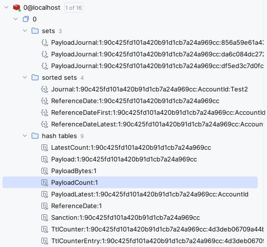

🚀Speed up implementation with hands-on, face-to-face [training](https://www.jube.io/jube-training) from the developer.

As introduced in the architecture section of this documentation, the real-time performance of the platform is in large
part owing to the use of a Remote Key Value \ Data Structure Pair data store, in the form of Redis (although these days
it
implies any RESP protocol). A Key Value Pair data store at first pass might appear analogous to a Relational Database
Management System (RDBMS). However, given the inability to query - as it can only access data via known keys—significant
thought
needs to be
given to schema.

In the Redis Schema set out in Jube, there are three data structures in use:

| Data Structure | Use Case                                                                                                                                                                                                                                                                                                                                                                                                                                            | 
|----------------|-----------------------------------------------------------------------------------------------------------------------------------------------------------------------------------------------------------------------------------------------------------------------------------------------------------------------------------------------------------------------------------------------------------------------------------------------------|
| Sets           | A structure that given a key maintains a list of values rolling up to a key.                                                                                                                                                                                                                                                                                                                                                                        |
| Sorted Sets    | A structure that given a key maintains a subset of keys preserving a prescribed order.                                                                                                                                                                                                                                                                                                                                                              |
| Hash Tables    | A structure that given a key maintains a large subset of key values rolling up (a key value within a key value).  Using Hash Tables over the  persistence of this same data in a more traditional key value pair, which would work fine, is thought to be less memory intensive (https://instagram-engineering.com/storing-hundreds-of-millions-of-simple-key-value-pairs-in-redis-1091ae80f74c), while maintaining a slightly more elegant schema. |

A visual example of the schema is as follows:

The key structure follows a commonplace Redis standard where components of the key are separated with a semicolon (
i.e., :).
Key segments uniformly include a tenant identifier immediately following the prefix (e.g., ReferenceDate:1, where 1 is
the tenant identifier). Guids are stripped of their hyphens, although this is the only place in the system where that is
done.

The prefixes are described in the following table:

| Prefix              | Type       | Key Structure                                                                                                                         | Description                                                                                                                                                                                                                                                                                                                                                                                                                                                                                                                                                              |
|---------------------|------------|---------------------------------------------------------------------------------------------------------------------------------------|--------------------------------------------------------------------------------------------------------------------------------------------------------------------------------------------------------------------------------------------------------------------------------------------------------------------------------------------------------------------------------------------------------------------------------------------------------------------------------------------------------------------------------------------------------------------------|
| PayloadJournal      | Set        | PayloadJournal:TenantRegistryId:EntityAnalysisModelGuid:EntityAnalysisModelInstanceEntryGuid                                          | For a given EntityAnalysisModelInstanceEntryInstanceGuid a journal or payloads references. This set is important for deletion of payload items to ensure that the references to the payload data removed from ledgers referencing it.                                                                                                                                                                                                                                                                                                                                    |
| Journal             | Sorted Set | Journal:TenantRegistryId:EntityAnalysisModelGuid:EntityAnalysisRequestXpathSearchKeyName:EntityAnalysisRequestXpathSearchKeyNameValue | Jube aggregates for EntityAnalysisRequestXpathSearchKeyName, for example all transactions for a given account identifier or IP. This sorted set maintains a list of payload references for a given EntityAnalysisRequestXpathSearchKeyName and EntityAnalysisRequestXpathSearchKeyNameValue combination,  preserving the order by reference date.                                                                                                                                                                                                                        |
| ReferenceDate       | Sorted Set | ReferenceDate:TenantRegistryId:EntityAnalysisModelGuid                                                                                | For each EntityAnalysisModelGuid, a record of its EntityAnalysisModelInstanceEntryGuid alongside its reference date in sorted order.  This sorted set is important to identify the current reference date prevailing for an EntityAnalysisModelGuid, with that value being offset and used for delete processing.                                                                                                                                                                                                                                                        |                                                                                                                                                                                                                                                                       |
| ReferenceDateFirst  | Sorted Set | ReferenceDateFirst:TenantRegistryId:EntityAnalysisModelGuid:EntityAnalysisRequestXpathSearchKeyName                                   | For each EntityAnalysisRequestXpathSearchKeyNameValue (e.g.,  AccountId of 123456) an ordered list of the oldest payload reference date available. This sorted set is useful to avoid a scan of the Redis database to identify only EntityAnalysisRequestXpathSearchKeyName and EntityAnalysisRequestXpathSearchKeyNameValue combinations that are in scope.                                                                                                                                                                                                             |
| ReferenceDateLatest | Sorted Set | ReferenceDateLatest:TenantRegistryId:EntityAnalysisModelGuid:EntityAnalysisRequestXpathSearchKeyName                                  | For each EntityAnalysisRequestXpathSearchKeyNameValue (e.g.,  AccountId of 123456) an ordered list of the latest payload reference date available.  This sorted set is used as an access path to the ledgers in conjunction with the LastestCount as an alternative to a scan, where the LatestCount is used as an access path to the PayloadDateLatest.                                                                                                                                                                                                                 |
| LatestCount         | Hash Table | LatestCount:TenantRegistryId:EntityAnalysisModelGuid                                                                                  | For a EntityAnalysisRequestXpathSearchKeyName the number of records maintained in ReferenceDateLatest,  while the number of entities is useful information,  it is primarily used as an access path - insofar as identification of GroupingFieldName - in deletion processing as an alternative to a scan, where the LatestCount is used as an access path to the PayloadDateLatest.                                                                                                                                                                                     |
| Payload             | Hash Table | Payload:TenantRegistryId:EntityAnalysisModelGuid                                                                                      | One of the most material data structures containing the largest payload byte volume,  representing the transaction data.  For an EntityAnalysisModelInstanceEntryGuid a byte array value is stored, which is an optimized MessagePack binary serialisation representing the full transaction payload processed.  Referenced in several other structures.                                                                                                                                                                                                                 |
| PayloadBytes        | Hash Table | PayloadBytes:TenantRegistryId                                                                                                         | Information only and relating to the total stored bytes for a model for the purpose of identifying usage in a multi tenancy environment without necessitating a scan.  Can be disabled via the RedisStorePayloadCountsAndBytes environment variable.                                                                                                                                                                                                                                                                                                                     |
| PayloadCount        | Hash Table | PayloadCount:TenantRegistryId                                                                                                         | Information only and relating to the total stored payload entries for a model for the purpose of identifying usage in a multi tenancy environment without necessitating a scan.  Can be disabled via the RedisStorePayloadCountsAndBytes environment variable.                                                                                                                                                                                                                                                                                                           |
| PayloadLatest       | Hash Table | PayloadLatest:TenantRegistryId:EntityAnalysisModelGuid:EntityAnalysisRequestXpathSearchKeyName                                        | For a EntityAnalysisRequestXpathSearchKeyName a contractless serialized MessagePack object containing various information about the latest payload, via a reference to the payload data, including as its most recent updated date which is used in abstraction rule caching for calculating time to live and reclassification status (reserved for future use).  In practice,  only the updated date and this could arguably be a much more lightweight schema, however,  it is envisaged that more advanced processing of latest transaction may happen in the future. |
| ReferenceDate       | Hash Table | ReferenceDate:TenantRegistryId                                                                                                        | For an EntityAnalysisModelGuid the current reference date being used for processing and offsetting,  used as an access path for Payload deletions.                                                                                                                                                                                                                                                                                                                                                                                                                       |
| Sanction            | Hash Table | Sanction:TenantRegistryId:EntityAnalysisModelGuid                                                                                     | For a given EntityAnalysisModelGuid, a cache of sanctions lookups to avoid burdensome Levenshtein Distance algorithm calculations, albeit subject to an expiration in online processing.  Uses the search string (i.e. Robert Mugabe) in composite with the distance prescribed (i.e. 2).  Returning a MessagePack contractless serialisation including the computed value from the Levenshtein Distance algorithm recall and the updated date for use expiry in online processing.                                                                                      |
| TtlCounter          | Hash Table | TtlCounter:TenantRegistryId:EntityAnalysisModelGuid:TtlCounterGuid:TtlCounterGroupingFieldName                                        | For a Time to Live Counter TtlCounterGroupingFieldName, the current counter value for a given TtlCounterGroupingFieldNameValue.                                                                                                                                                                                                                                                                                                                                                                                                                                          |
| TtlCounterEntry     | Hash Table | TtlCounterEntry:TenantRegistryId:EntityAnalysisModelGuid:TtlCounterGuid:TtlCounterGroupingFieldName:TtlCounterGroupingFieldNameValue  | To facilitate the deprecation of Time to Live Counters, grouping by a given date resolution, the number of incrementation for the date resolution, for a given TtlCounterGroupingFieldName and TtlCounterGroupingFieldNameValue combination.  Used for the deprecation of counters in the TTLCounter prefixed data structure on expiry.                                                                                                                                                                                                                                  |

In the current release of Jube, Latest values are maintained on a largely informational basis but are reserved for
future use in payload reclassification.

The Payload prefix can be subject to compression based on the RedisMessagePackCompression environment variable, in
which case LZ4 Block Array Compression will be used. While LZ4 compression is extremely fast and introduces only
negligible overhead, for a small payload, there is scant compression benefit. 