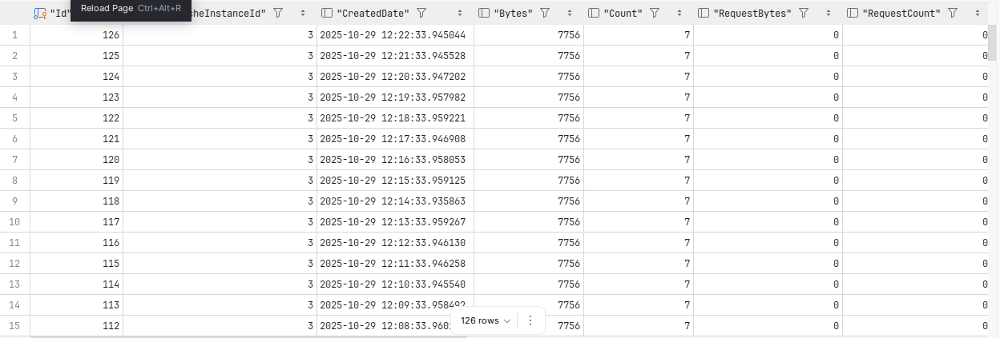

🚀Speed up implementation with hands-on, face-to-face [training](https://www.jube.io/jube-training) from the developer.

As introduced in the architecture section of this documentation, the real-time performance of the platform is in large
part owing to the use of a Remote Key Value \ Data Structure Pair data store, in the form of Redis (although these days
it implies any RESP protocol). In many cases the centralization of and the serialized access to this data are extremely
important, especially in maintaining the latest transaction ledgers, so that irrespective of the node processing the
transaction, the transaction order is preserved.

Referencing the Cache Schema documentation, it can be noted that one of the Payload prefixes contains data referenced
intensely, and to a degree inefficiently, with the trade being no duplication of Payload storage for the
ledgers. For example, consider a search key that has a limit of 100 records, and consider that
there might be four of them; for each transaction stored in the ledger the payload will need to be recalled from Redis,
and while Jube manages this process across to ensure there is no duplication of Payload requests, it remains a
significant
and inefficient request volume for Redis, and significant transport overhead.

Jube is quite compute intensive given the level of task parallelism that happens during transaction processing. Assuming
that Jube is configured using compute from one of the hyperscalers (e.g., AWS, Azure, Digital Ocean),  
this may well create a situation where to compute provisioned (i.e., Virtual Machine) has a large amount of redundant
memory.  
Meanwhile, for Redis, given the load that Payload matching causes on the Redis Server, and that running cost of Redis
in practice, Redis is substantially and inefficiently overallocated.

To improve performance, achieve better memory server density and better Redis allocation, Jube maintains a local Least
Recently (LRU) cache of
the Payload prefix data. During transaction processing, for Payload prefix data referencing, the local LRU cache is
attempted,
and Redis is used only in case of a cache miss. Serialization schemas are common in both the local LRU cache and
Redis, being optimised MessagePack
binary serialization, and it followed that deserialization overhead is unaffected given local or remote Payload recall.

Given the total availability of Payload prefix data in the local LRU cache, a fourfold improvement in transaction
throughput can be achieved.

The local LRU cache can evict Payload prefix data given the total size of the local LRU cache exceeding a value set in
the
LocalCacheBytes environment variable. It is oftentimes possible to maintain all Payload prefix data in the local cache,
however, even partial cache hits, there remains significant performance improvement given a significant proportion of
load being
offloaded to the local LRU cache. Given that the local LRU cache is on the basis of least recently used eviction,
it affords a better than proportional reduction in a Redis load.

The local LRU cache is enabled by default for 1GB but is subject to the LocalCache environment variable.

The LocalCacheFill environment variable determines if on Jube startup if the local cache should be filled from Redis
with
a hash scan, and is the default. In the event that fill is disabled, it will allow a faster startup, but at the expense 
of increased pressure on Redis, and is henceforth discouraged.

Given an arrangement of Jube in a clustered and highly available manner, it is incumbent to update all Jube
instances local LRU caches. Subject to the RedisPublishSubscribeEvents environment variable, events are published on the
addition, update, and deletion to the
local LRU cache., Distributed instances of Jube are subscribed to the events, updating its local LRU cache to maintain
parity between all instances.
Events are published using the Redis Publish\Subscribe functionality, based on the following structure:

| Prefix     | Type   | Key Structure                                                   | Value                                |
|------------|--------|-----------------------------------------------------------------|--------------------------------------|
| HashSet    | Create | HashSet:Server:InstanceCorrelationGuid:PayloadKey:HashSetKey    | MessagePack serialisation of payload |
| HashRemove | Remove | HashRemove:Server:InstanceCorrelationGuid:PayloadKey:HashSetKey | None                                 |

A shortcoming of the Redis Publish\Subscribe functionality is that it can't discriminate where events have
originated from itself. Henceforth, the Server and InstanceCorrelationGuid combination that created the event - which by
implication will already
maintain an up-to-date local LRU cache - will be subscribed, potentially creating a recursion. On receipt of events, the
Server and InstanceCorrelationGuid are compared. Server and InstanceCorrelationGuid definitively Server and 
InstanceCorrelationGuid definitively identify the event’s source. Given own source, then it will not update the local LRU cache, and it will be completely ignored.

Given the significant effect the local LRU cache can have on overall performance, observability is provided via three
Postgres tables that are updated every minute:

| Table                 | Description                                                                                                                                                                                                 |
|-----------------------|-------------------------------------------------------------------------------------------------------------------------------------------------------------------------------------------------------------|
| LocalCacheInstance    | The total bytes and payloads stored in the local LRU cache,  the .Net memory pressure and details on the status of a fill (updated for each 100k filled).                                                   |
| LocalCacheInstanceKey | For a given Redis Key,  the number and bytes of requests, misses, Hash Set subscriptions received and Hash Removal Subscription received. Includes , Redis response time on miss and deserialization times. |
| LocalCacheInstanceLru | For the local LRU cache, the total bytes and payloads available, the number, and bytes, of requests, updates, additions, removals and eviction.                                                             |

For example, for the LocalCacheInstanceLru table:

```sql
select *
from "LocalCacheInstanceLru"
order by 1 desc
```



The local LRU cache shares the same compression schema as Redis, subject to the RedisMessagePackCompression environment
variable.