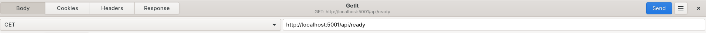

🚀Speed up implementation with hands-on, face-to-face [training](https://www.jube.io/jube-training) from the developer.

# SIGTERM Handling

SIGTERM is handled robustly via the centralisation of a cancellation token in the application. The application
background tasks are all dismantled on the basis of instruction to the singular cancellation token. The application is designed to
shut down very quickly and very safely to fully support dynamic scaling of the application with tooling such as
Kubernetes or Docker Swarm.

On cancellation all background tasks monitor for cancellation, and will gracefully exit if sensitive, otherwise cause
immediate cancellation if inconsequential. In the case of background
tasks that are responsible for draining concurrency queues, asynchronous database writes and Redis cache prune,
these queues will be drained before cancellation (the application won't drop data on SIGTERM). On SIGTERM, in the event
that a background task can't be stopped for reasons of draining, its cancellation status will be
written out to console every two seconds for observability.

Upon SIGTERM, an inflight requests via the embedded Kestrel server or AMQP will be drained also, being allowed to fully
conclude. In the case of HTTP requests, on SIGTERM, any requests being served as part of drainage will include a disconnect header
instructing the client to consider the connection as closed, notwithstanding the response.

# Ready Endpoint

To determine if the application is ready to serve requests, a Ready Endpoint is available at
https://localhost:5001/api/ready:

The Ready Endpoint will return HTTP Status Code 200 when ready, otherwise HTTP Stratus Code 503. The Ready Endpoint is
also the backing for Docker health check, and is included in the Docker File. 
It follows that Docker communication of health status rests upon receiving a 200 HTTP Status from this endpoint

In the case of SIGTERM having been received, the Ready Endpoint will immediately return HTTP Status Code 503.

The Ready Endpoint checks for the instantiation of the following services:

* Implicitly the instantiation of the Kestrel Web Server.
* In the case of the EnableEngine environment variable being true, the Engine instantiation, which implies models,
  sanctions and any other dependencies have been loaded.
* In the case of the StreamingActivationWatcher environment variable being true, the Relay instantiation, which implies
  readiness to relay information to the Activation Watcher.
