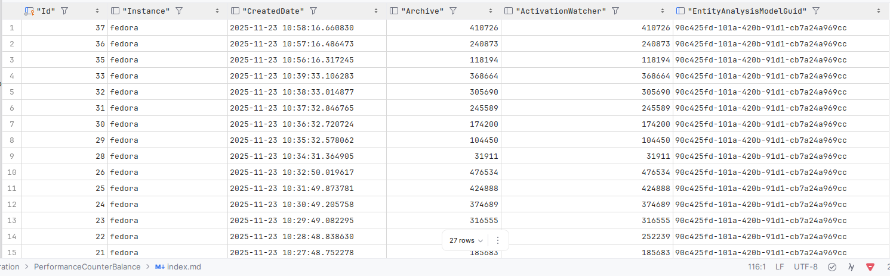

🚀Speed up implementation with hands-on, face-to-face [training](https://www.jube.io/jube-training) from the developer.

# Performance Counter Balances

The nature of the Jube Platform is that immeasurable harm can be caused by the misconfiguration of a rule. Consider a
scenario where all bank transactions are declined or all bidding is taking place on all impression opportunities as a
consequence of a bad Activation Rule. Furthermore, the nature of real-time, ultra-high throughput systems, is that it is
not especially feasible to measure performance on a transaction by transaction basis, instead relying on near time
aggregate counters and statistics to measure the performance of the platform.

Counters keep a track of events that take place in Jube. There are two types of counter, which are known as Rolling
counters and Reset counters:

* Rolling Counters when being incremented keep a record of the date and time of each component causing the counter to be
  incremented, which allow for the counter to be decremented at the point in time each counter entry expires. The
  Rolling Counter will never be reset to zero, rather it will maintain a balance of counter entries moving in, then
  moving out of the counter.
* Reset Counter are reset to zero every minute.

Rolling Counters include:

* Each time a Response Elevation is returned, greater than zero, a counter in incremented.
* Each time a Response Elevation is returned, greater than zero, a counter is increased by the value of the Response
  Elevation. Rather than a counter, it is a sum or balance.
* Each time a message is sent to the Activation Watcher, a counter is incremented.

Reset Counters include:

* Each time a transaction is processed through a model, a counter is incremented.
* Each time a Gateway Rule is matched upon, a counter is incremented.
* Each time a request is received on the Web Server \ HTTP Endpoint, a counter is incremented.
* Each time the HTTP Endpoint is switched to invoke an Entity Model, a counter is incremented.
* Each time the HTTP Endpoint is switched to invoke Entity Model Tagging, a counter is incremented.
* Each time the HTTP Endpoint is switched to recall an Exhaustive Adaptation directly, a counter is incremented.
* Each time the HTTP Endpoint is switched and has encountered an Error, a counter is incremented.
* Each time the HTTP Endpoint is switched to invoke an Entity Model asynchronously, a counter is incremented.

The HTTP counters can be inspected by navigating to Administration >>  Performance >> HTTP Processing Counters.

It can be observed throughout this documentation that in memory asynchronous queues features heavily in the platforms
architecture.

This counters routine is also responsible for recording the asynchronous queue balances on a snapshot basis.

For each model the following asynchronous queue balances are maintained:

* The number of payload records pending initial processing by the bulk insert routine and case creation routine.
* The number of case records pending processing.
* The number of Activation Watcher entries pending dispatch and storage.

The model asynchronous queue balances can be inspected by navigating to Administration >>  Performance >> Model
Asynchronous Queue Balances.

For the platform the following asynchronous queue balances are maintained in the overall execution:

* The number of Tags currently pending in the in memory asynchronous queue.
* The number of Real Time Model Invocation Entity objects pending invocation in the in memory asynchronous queue.

The asynchronous queue balances can be inspected by navigating to Administration >>  Performance >> Queue Asynchronous
Balances.

# Observability Tables

Performance counter balances are written to PostgreSQL tables every 60 seconds. These tables are available for
monitoring and alerting purposes.

In addition, several observability tables provide visibility into critical software areas where reliability is
paramount. These areas include:

- Least Recently Used (LRU) cache
- Redis payload eviction
- Redis payload latest eviction
- Redis TTL counter eviction
- Real-time performance counters
- Local concurrent queue balances (used for asynchronous operations such as writes)

| Table                                        | Description                                                                                                                                                                                                                                      |
|----------------------------------------------|--------------------------------------------------------------------------------------------------------------------------------------------------------------------------------------------------------------------------------------------------|
| CacheTtlCounterEntryRemovalBatch             | Records reference date expiration events for processing expired Time-to-Live (TTL) counters. Includes system reference date, overall expired counts, first and most recent reference dates. A record exists only if expired records are present. |
| CacheTtlCounterEntryRemovalBatchEntry        | Contains TTL counter entries that have been updated or purged, including the system reference date, deprecated value, and revised counter value.                                                                                                 |
| CacheTtlCounterEntryRemovalBatchResponseTime | Details task performance and response times for TTL counter maintenance.                                                                                                                                                                         |
| CachePayloadLatestRemovalBatch               | Tracks expiration of Payload Latest data for a given search key, including system reference date, total expired records, and first and most recent reference dates.                                                                              |
| CachePayloadLatestRemovalBatchEntry          | Contains details of payload latest values removed in a batch.                                                                                                                                                                                    |
| CachePayloadLatestRemovalBatchResponseTime   | Details task performance and response times for CachePayloadLatestRemovalBatch.                                                                                                                                                                  |
| CachePayloadRemovalBatch                     | Tracks expiration of payload data, including system reference date, total expired records, and first and most recent reference dates.                                                                                                            |
| CachePayloadRemovalBatchEntry                | Contains details of payload GUIDs removed in a batch.                                                                                                                                                                                            |
| CachePayloadRemovalBatchResponseTime         | Details task performance and response times for CachePayloadRemovalBatch.                                                                                                                                                                        |
| LocalCacheInstance                           | Tracks counts and memory pressure of the local cache.                                                                                                                                                                                            |
| LocalCacheInstanceKey                        | Tracks performance metrics and counters for a corresponding Redis key, including requests, misses, removals, distributed subscriptions, and response times. Highlights local cache pressure and cache misses, indicating load on Redis.          |
| LocalCacheInstanceLru                        | Tracks LRU cache performance metrics, including bytes and counters for additions, removals, updates, and evictions.                                                                                                                              |
| EntityAnalysisAsynchronousQueueBalance       | Tracks system-level background concurrency tasks, such as asynchronous model invocations, pending callbacks, case creation backlogs, pending notifications, and tags pending storage.                                                            |
| EntityAnalysisModelAsynchronousQueueBalance  | Tracks model-level background concurrency tasks, such as records pending storage to archive and activation watcher dispatch.                                                                                                                     |
| EntityAnalysisModelProcessingCounter         | Tracks model invocation events and limit breaches, including overall invocations, gateway flow counts, response elevations, total response elevations, pressure on response elevation limits, and activation watcher activity.                   |
| HttpProcessingCounter                        | Tracks overall HTTP counters for API requests.                                                                                                                                                                                                   |

The tables can be queried simply via SQL,  and filtered as required for monitoring.  For example,  to monitor for Archive events backing up:

``` sql
select * from "EntityAnalysisModelAsynchronousQueueBalance"
         where "Archive" > 1000
         order by 1 desc
```




