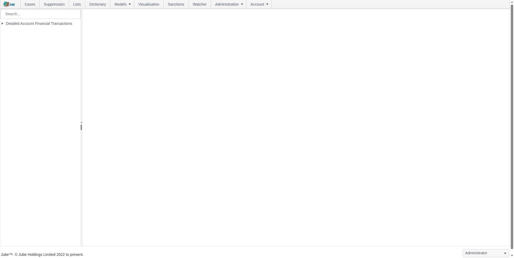
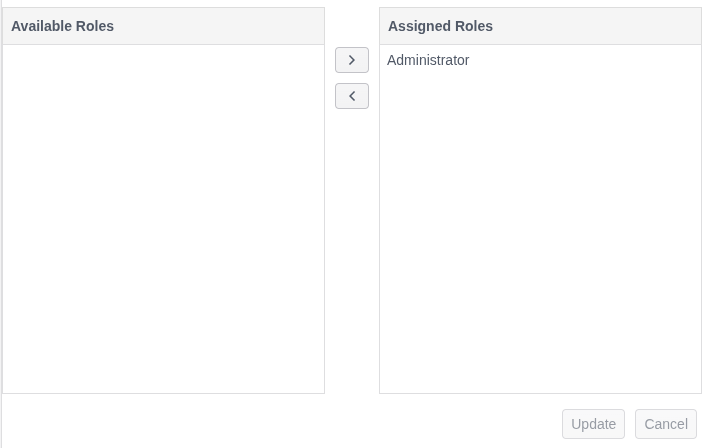
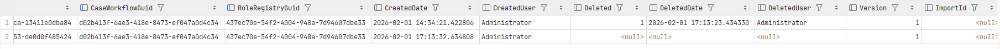

# Role Assignment Overview

Entities relating to case management allow for the allocation of roles for the isolation of Case data by that entity.
In a practical sense, it allows for the hiding of data which has been escalated in
a Case, or the removal
of certain actions or data availability upon that Case. Consider the scenario where a Case has been created on one
status, yet the analyst deems it at that stage appropriate to escalate it
to the next level of review. Should that Case then be further escalated, it might arrive at a level of concern where the
Case is no longer appropriate to be accessed by junior analysts, which would be true of not only the Case, but other
supporting material for the Case including Case Notes, Case Uploads and Case Journal and Case Audit. Case data isolation
represents an important regulatory requirement.

Every Case entity supports the allocation of roles and therefore isolation of data where that entity is apportioned.

The role allocations are joined upon recall in the Cases and Cases page, having the effect of that data not being
in existence unless it is possible to join back to the user, through the role, through the allocation and to that Case
entity.



Taking the Case Workflow Entity, which is available by navigating Models >>> Case Workflows >>> Case Workflows, then
clicking on the Case Workflow in the tree on the left:



Note the Role Allocation widget below the Update and Delete buttons.

The Role Allocation widget is common to the following Case entities:

* Case Workflows.
* Case Workflow Status.
* Case Workflow XPath.
* Case Workflow Form.
* Case Workflow Action.
* Case Workflow Display.
* Case Workflow Macro.
* Case Workflow Filter.

The Role allocations have different implications to data Case entity isolation, as is explained in the section below.

The left hand side of the Role Allocations widget are available roles, while the right side is roles having been
allocated.
In the above, Administrator is allocated (this happens in migrations for the Administrator role in the Landlord
Tenant only,  
and otherwise they need to be manually created).

In the database, Role allocations are logically deleted (e.g., "Deleted" = 0), and there remains a full audit of role
allocations:

``` sql
select * from "CaseWorkflowRole"
```



The Role allocations are fully supported in Preservation, which ensures that Role allocations are available for the
Import and Export of a tenant environment.

# Cases Page Isolation

Cases Page refers to the searching of cases based upon a given criteria, for example, all Open cases for a given Case
Workflow Status and not Locked. Escalation is performed by upwardly moving Case Workflow Status allocations via the Case
page.

Case Page isolation exhibits the following behaviors:

| Recall                                             | Role Allocation Isolation               | Description                                                                                                                                                                                                                                                                                                                                                                                                                                                               |
|----------------------------------------------------|-----------------------------------------|---------------------------------------------------------------------------------------------------------------------------------------------------------------------------------------------------------------------------------------------------------------------------------------------------------------------------------------------------------------------------------------------------------------------------------------------------------------------------|
| Available Case Workflows                           | Case Workflow.                          | The Case Workflow will only be available in the selection tree given Case Workflow Role Allocation.                                                                                                                                                                                                                                                                                                                                                                       |
| Available Case Workflow Filter                     | Case Workflow and Case Workflow Filter. | The Case Workflow will only be available in the selection tree given Case Workflow Role Allocation and Case Workflow Filter Role Allocation.  The Case Workflow Filter Role Allocation is largely cosmetic,  as the same isolation is enforced in the Cases Session Query (i.e., Peek and Skim).                                                                                                                                                                          |
| Cases Session Query (Peek and Skim)                | Case Workflow and Case Workflow Status. | On Peek or Skim a query is composed on the basis of configuration made in the Select and Filter options of the Case Workflow Filter, navigated to via the selection tree.  The Case Session Query will join through the Role Allocations for Case Workflows and Case Workflow Status and only on a sucessful join of both Case Workflow and Case Workflow Status will the data be returned.  The same Case Session Query is used across both Peek and Skim functionality. |
| Completions \ Query Builder Completion Availablity | Case Workflow XPath.                    | Specific fields can be hidden from Case Payload and the Case Key Journal in the Case page, and this is represented also in the availability of those fields in the Completions \ Query Builder Completion Availablity and the Cases Session Query (Peek and Skim).  Some care needs to be taken not to create a conflict with the availability of fields in Case Workflow Filters Role allocations and Case Workflow XPath Role allocations.                              |

# Case Page Isolation

Case Page isolation exhibits the following behaviors:

| Recall                         | Role Allocation Isolation                                     | Description                                                                                                                                                                                                                                                                                                                                                                                                                                                                                                                                    |
|--------------------------------|---------------------------------------------------------------|------------------------------------------------------------------------------------------------------------------------------------------------------------------------------------------------------------------------------------------------------------------------------------------------------------------------------------------------------------------------------------------------------------------------------------------------------------------------------------------------------------------------------------------------|
| Case Key Journal               | Case Workflow XPath.                                          | The Case Key Journal fetches Archive records on the basis of the Case Key and Case Key Value combination in the json payload data in the Postgres database.  It will return all data matching.  The actual fields presented can be restricted using the Case Workflow XPath, which is useful for hiding sensitive or otherwise encrypted data.                                                                                                                                                                                                 |
| Case Workflow Display          | Case Workflow Display and Case Workflow XPath.                | The Case Workflow Display restricts a formal presentation of the data returned in the Case Key Journal,  extracting the transaction payload information for the matching transaction guid only and presenting that as Case context.  On Case Workflow Display Role Allocation being available the option to render will be in the selection drawer, otherwise unavailable.                                                                                                                                                                     |
| Case Journal                   | Case Workflow and Case Workflow Status.                       | The Case Journal is an audit of all Cases opened, and then closed, on a Case Key and Case Key value comobination.  The Case Jounal will only return records given Case Workflow Allocation and Case Workflow Status Allocation matching via the Case Id.                                                                                                                                                                                                                                                                                       |
| Case Notes                     | Case Workflow, Case Workflow Status and Case Workflow Action. | The Case Notes returns all notes created under a Case Key and Case Key value combination.  The Case Notes will only retyrn return records given Case Workflow Allocation and Case Workflow Status Allocation matching via the Case Id.  Furthermore,  the Case Notes are isolated by Case Workflow Action Role Allocation,  which allows for the more general hiding of notes based on Case Workflow Actions available to a given role.                                                                                                        |
| Case Events Journal            | Case Workflow and Case Workflow Status.                       | The Case Events Journal is a granular record of Case access and maintaiance by a user or background engine.  The Case Jounal will only return records given Case Workflow Allocation and Case Workflow Status Allocation matching via the Case Id.  Granular isolation of the audit entry type is not supported,  henceforth,  if a case is deemed sensitive,  it needs to be moved to a Case Workflow Status to have the effect of isolating the full audit.                                                                                  |
| Case Forms Journal             | Case Workflow, Case Workflow Status and Case Workflow Form.   | The Case Forms Journal is a granular record of invocations of the Case Workflow Forms functionaltity,  including a capture of all data submitted via the form, alongside the Case context. The Case Jounal will only return records given Case Workflow Allocation and Case Workflow Status Allocation matching via the Case Id.  Case Request XPath Role Allocation is not supported at this time, henceforth,  if a case is deemed sensitive,  it need to be moved to a Case Workflow Status to have the effect of isolating the full audit. |
| Case Uploads                   | Case Workflow and Case Workflow Status.                       | The Case Uploads is a container of all documents brought together for a Case Key and Case Key Value combination.  The Case Uploads will only return records given Case Workflow Allocation and Case Workflow Status Allocation matching via the Case Id.                                                                                                                                                                                                                                                                                       |
| Case Visualiation              | Delegated to Visualisation, as documented elesewhere.         | The Case Visualisation is configured in the Case Workflow to pair to a Visualisation, but otherwise,  it is functionality that is entirely delegated to the Visualisation Role Allocation functionality of the system.  Refer to Security Policy for Visualisation.                                                                                                                                                                                                                                                                            |
| Case Workflow Macro Invocation | Case Workflow Macro and Case Workflow.                        | Putting aside that in the absence of Role Allocation, the Case Workflow Macro will not be displayed, a Case Workflow Macros invocation verifies Case Workflow Macro Role Allocation and Case Workflow Role Allocation before allowing for execution.  The full Case context is made available for Case Workflow Macro invocation.  Bad request is returned in the case of invalid permissions on invocation.                                                                                                                                   |
| Case Form Invocation           | Case Workflow and Case Worfkflow Form.                        | Putting aside that in the absence of Role Allocation, the Case Workflow Form will not be displayed, a Case Workflow Form invocation verifies Case Workflow Form Role Allocation and Case Workflow Allocation. The full Case context is made available for Case Workflow Macro invocation.  Bad request is returned in the case of invalid permissions on invocation.                                                                                                                                                                           |
| Case Update                    | Case Workflow and Case Workflow Status.                       | Case update validates the Case Workflow Status Allocations and Case Workflow Roles Allocations, returning Bad Request in the event that an update is requested without appropriate allocation.                                                                                                                                                                                                                                                                                                                                                 |
| Case Fetch                     | Case Workflow and Case Workflow Status.                       | Returning not found in the case of Case Workflow and Case Workflow Status not being allocated.                                                                                                                                                                                                                                                                                                                                                                                                                                                 |


