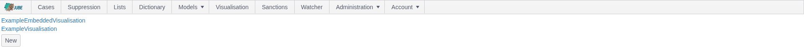
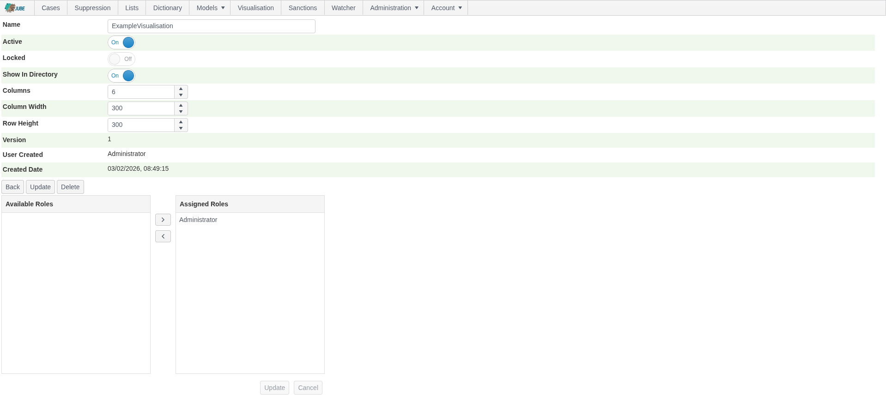

# Role Assignment Overview

Before embarking on this section of documentation it is incumbent to explain that the functionality aims to provide
for a similar use case as Case isolation, and in the interests of being concise, the explanation of database duplication is not repeated.  
It is suggested to review the core concepts under Configuration >>> Case Management >>> Security Policy beforehand.

Every Visualisation entity supports the allocation of roles and therefore isolation of data where that entity is
apportioned.

The role allocations are joined upon recall in the Visualisation page, and its embedding in the Case page, having the
effect of that data not being
in existence unless it is possible to join back to the user, through the role, through the allocation and to that
Visualisation entity.

Taking the Visualisation Entity, which is available by navigating Administration >>> Visualisation >>> Visualisation,
then clicking on the Visualisation entry link:

Note the Role Allocation widget below the Update and Delete buttons.

The Role Allocation widget is common to the following Visualisation entities:

* Visualisation.
* Visualisation Parameter.
* Visualisation Datasource.

The Role allocations have different implications for data Visualisation entity isolation, as is explained in the section
below.

The left-hand side of the Role Allocations widget shows available roles, while the right side shows roles that have been
allocated. In the above, Administrator is allocated (this happens in migrations for the Administrator role in the Landlord
Tenant only, and otherwise they need to be manually created).

# Visualisation Recall Page Isolation

The Visualisation Recall page is responsible for the invocation and full recall of datasources, and the rendering of
responses from the database as with grids or charting as embedded.

Visualisation Recall Page isolation exhibits the following behaviours:

| Recall                                 | Role Allocation Isolation               | Description                                                                                                                                                                                                                                                                                                                      |
|----------------------------------------|-----------------------------------------|----------------------------------------------------------------------------------------------------------------------------------------------------------------------------------------------------------------------------------------------------------------------------------------------------------------------------------|
| Visualisation Recall                   | Visualisation.                          | The availability of a Visualisation to a role, where the link to Visualisation recall will be hidden if the Role Allocation is not available.                                                                                                                                                                                    |
| Visualisation Parameter Entry          | Case Workflow and Case Workflow Filter. | The selective availability of Visualisation Parameters. In the event a Visualisation Parameter is hidden, the fallback value for that parameter is taken to be the default value configured. This functionality allows for a robust means to isolate data to given users, while providing wider search scope for administrators. |
| Visualisation Datasource (Card) Recall | Case Workflow and Case Workflow Status. | A Visualisation is a collection of individual reports that have a common parameter set, and can be restricted in their recall based upon Role Allocation. In the case of direct recall of the API endpoints given no Role Allocation, Bad Request will be returned.                                                               |

All security policy is applied in the same manner to Visualisation where it is embedded in a Case Workflow, and it follows that Role Allocations must be sympathetic to the Case Workflow Role Allocations.